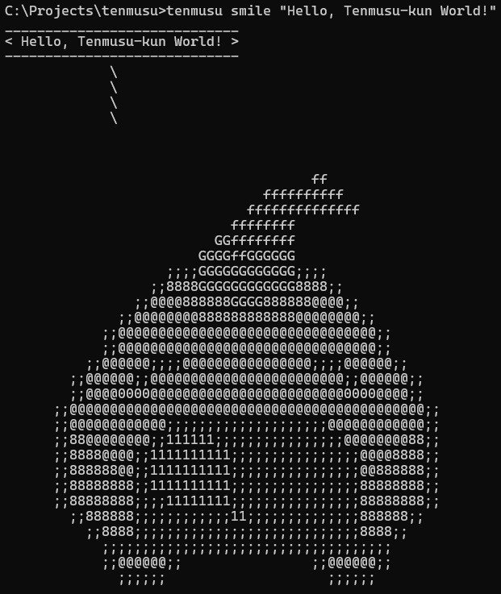

# tenmusu
`tenmusu` - A CLI to display Tenmusu-kun ASCII art (hello, smile, sing...).  




## Installation
1. Clone the repository:
   ```bash
   git clone https://github.com/irusukan/tenmusu.git
   ```

1. Install dependencies:
    ```bash
    cd tenmusu
    npm install
    ```

1. Link the command globally:
    ```bash
    npm link
    ```

## Usage
- Display Tenmusu-kun ASCII art:
    ```bash
    - tenmusu hello (ASCII art only)
    - tenmusu smile "Hello, world!" (with speech bubble)
    - tenmusu sing "Sing it!" --width 20
    ```

- Options:  
    - -V, --version:  
    output the version number
    - -w, --width <number>  
    Output width in characters (10, 20, 30) (default: "30")
    - -h, --help  
    display help for command

## Help:
    tenmusu --help
<br>

    Usage: index [options] [name] [message]

    Arguments:
    name                hello: Show hello(normal) tenmusu-kun 
                        smile: Show smile tenmusu-kun
                        sing: Show singing tenmusu-kun
                        jump: Show jumping tenmusu-kun
                        wink: Show wink tenmusu-kun
                        sad: Show sad tenmusu-kun
                        apology: Show apologizing tenmusu-kun
                        run: Show running tenmusu-kun
                        excl: Show ! tenmusu-kun
                        
    message               tenmusu-kun say "message"

    Options:
    -V, --version         output the version number
    -w, --width <number>  Output width in characters (10, 20, 30) (default: "30")
    -h, --help            display help for command

